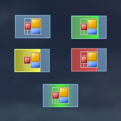
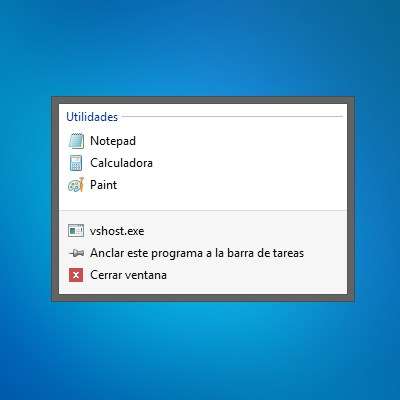
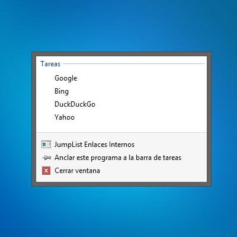
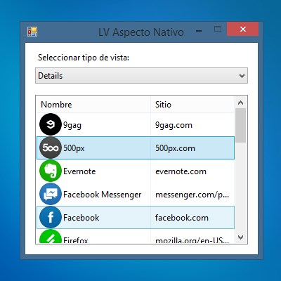
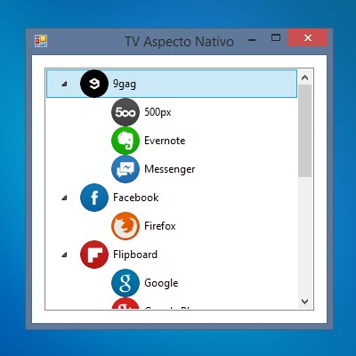

# Windows Forms - Aspecto Nativo
Pequeños proyectos de Windows Forms para proporcionarles un aspecto nativo del sistema operativo Windows.

## Indicador de progreso en la barra de tareas

## JumpList - Enlaces externos

## JumpList - Enlaces internos

## Listview - Aspecto nativo

## Treeview - Aspecto nativo
